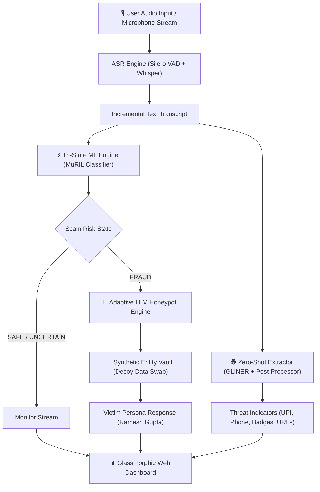

# 🛡️ ArrestShield-Live

> **Real-Time Multilingual Digital Arrest Scam Detection Engine & Adaptive LLM Honeypot**

[](https://www.python.org/)
[](https://fastapi.tiangolo.com/)
[](https://pytorch.org/)

**ArrestShield-Live** is an end-to-end, multi-stage defense system engineered to detect, intercept, and neutralize **Digital Arrest & Financial Coercion Scams** (impersonating Indian Law Enforcement agencies such as Mumbai Police, CBI, ED, TRAI, and Supreme Court) in real-time.

---

## 🌟 Key Features

* **🎙️ Streaming Multilingual ASR (`Silero VAD` + `faster-whisper`)**: Converts streaming audio chunks into incremental Hinglish/Hindi speech transcripts under **800ms latency**.
* **⚡ Multi-Task MuRIL Tri-State Risk Engine**: Fine-tuned on `google/muril-base-cased` to classify scam risk (`SAFE`, `UNCERTAIN`, `FRAUD`), predict 4 psychological threat triggers (*Authority Impersonation, Urgency, Isolation, Payment Pressure*), and track 6 progression stages.
* **🤖 Adaptive LLM Honeypot (`Qwen2.5-7B-Instruct`)**: Automatically activates upon `FRAUD` detection, engaging scammers using a realistic synthetic victim persona (*Ramesh Chandra Gupta*) through a 4-stage state machine (*Confused* $\rightarrow$ *Frightened* $\rightarrow$ *Cooperative* $\rightarrow$ *Stalling*).
* **🔐 Synthetic Entity Vault**: Dynamically intercepts sensitive coordinates and swaps real payment credentials with pre-validated synthetic decoy data (decoy bank accounts, UPI IDs, fake OTPs).
* **🕵️‍♂️ Zero-Shot Threat Intelligence Extraction (`GLiNER`)**: Parses transcripts in real time for actionable threat parameters (UPI IDs, phone numbers, fake police badge IDs, court reference numbers, and phishing URLs).
* **💻 Glassmorphic Web Dashboard**: Real-time Web Audio API streaming frontend featuring interactive risk score gauges, trigger progress meters, live threat logs, and preset scam scenario simulations.

---

## 🏗️ System Architecture



---

## 🚀 Quick Start Guide

### 1. Prerequisites
- **Python 3.10+** installed.
- Git & Virtual environment tools.

### 2. Installation
Clone the repository and install dependencies:
```bash
git clone https://github.com/nandani08/ArrestShield.git
cd ArrestShield

# Activate virtual environment
.\venv\Scripts\activate   # On Windows
source venv/bin/activate  # On Linux/macOS

# Install dependencies
pip install -r requirements.txt
```

### 3. Launching the Web Dashboard & FastAPI Server
Start the server:
```bash
python app.py
```
Open your browser and navigate to:
👉 **`http://localhost:8000`**

- Click **`🚨 Digital Arrest Scam`** or **`💳 UPI Payment Scam`** to test preset simulations.
- Click **`🎙️ Start Mic Stream`** to test live microphone speech recognition.

---

## 🧪 Testing & Verification

Run the full repository test suite across all 48 test cases:
```bash
python -m unittest discover -s tests -p "test_*.py"
```

Run the End-to-End Scam Simulation Test:
```bash
python -m unittest tests/test_end_to_end_simulation.py
```

---

## 🛠️ Technology Stack

| Layer | Technologies Used |
| :--- | :--- |
| **Speech Recognition** | Silero VAD, Faster-Whisper (`shunya-labs/zero-stt-hinglish`) |
| **Scam Classifier** | PyTorch, HuggingFace Transformers (`google/muril-base-cased`) |
| **Threat Extraction** | GLiNER Zero-Shot NER (`urchade/gliner_medium-v2.1`), Regex Post-Processors |
| **LLM Honeypot** | Ollama / vLLM (`Qwen2.5-7B-Instruct`), Synthetic Entity Vault |
| **Backend & Web API** | FastAPI, WebSockets, Uvicorn, Pydantic |
| **Frontend UI** | HTML5 Canvas, Vanilla CSS Glassmorphic Design System, Web Audio API |

---

## 📜 License

This project is licensed under the **MIT License** - see the [LICENSE](LICENSE) file for details.
